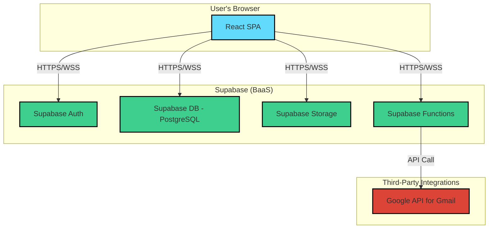

# Simplr Invoicing - System Architecture

## 1. Executive Summary

This document provides a comprehensive overview of the system architecture for the Simplr Invoicing application. It is intended for developers, architects, and technical stakeholders to understand the system's design, components, and technical choices. Simplr Invoicing is a modern, web-based platform designed to streamline the invoicing process for freelancers and small businesses, offering a user-friendly interface for managing clients, creating professional invoices, and tracking payments.

## 2. Business Context

The primary audience for Simplr Invoicing is small business owners and freelancers who require a simple, efficient, and reliable tool for managing their invoicing workflows. The key business goals are:

-   **Efficiency:** Reduce the time and effort spent on creating and managing invoices.
-   **Professionalism:** Provide a professional and customizable invoicing solution.
-   **Usability:** Offer a seamless and intuitive user experience.
-   **Security:** Ensure robust data security and user privacy.

## 3. High-Level Architecture

Simplr Invoicing is a **Single-Page Application (SPA)** built with a modern frontend stack and powered by a **Backend-as-a-Service (BaaS)** platform. This architecture was chosen for its ability to deliver a fast, responsive, and app-like user experience while simplifying backend management.

### Architecture Diagram

The following diagram illustrates the high-level architecture of the system:



### Technology Choices

The application leverages a curated set of modern technologies to achieve its goals:

-   **Frontend Framework:** [React](https://reactjs.org/) with [TypeScript](https://www.typescriptlang.org/) for building a type-safe, scalable, and component-based user interface.
-   **Build Tool:** [Vite](https://vitejs.dev/) for its fast development server and optimized build process.
-   **Backend-as-a-Service (BaaS):** [Supabase](https://supabase.io/) provides the core backend infrastructure, including:
    -   **Database:** A managed [PostgreSQL](https://www.postgresql.org/) database.
    -   **Authentication:** Secure user authentication with email/password and social providers.
    -   **Storage:** For user-uploaded files like company logos and invoice PDFs.
-   **Styling:** [Tailwind CSS](https://tailwindcss.com/) for a utility-first styling approach, combined with [shadcn/ui](https://ui.shadcn.com/) for a pre-built, accessible component library.
-   **State Management:**
    -   [Zustand](https://github.com/pmndrs/zustand) for simple, scalable global state management.
    -   [TanStack Query (React Query)](https://tanstack.com/query/v5) for managing server state, including data fetching, caching, and synchronization.
-   **Routing:** [React Router](https://reactrouter.com/) for declarative, client-side routing.
-   **Form Management:** [React Hook Form](https://react-hook-form.com/) for performant form handling, coupled with [Zod](https://zod.dev/) for robust schema validation.
-   **PDF Generation:** [jsPDF](https://github.com/parallax/jsPDF) and [jspdf-autotable](https://github.com/simonbengtsson/jsPDF-AutoTable) for client-side generation of professional PDF invoices.
-   **Testing:** [Vitest](https://vitest.dev/) and [React Testing Library](https://testing-library.com/docs/react-testing-library/intro/) for unit and component testing.

## 4. Major System Components

The application is broken down into several key functional areas, each with a dedicated set of components and logic.

### 4.1. Invoice Management

The core feature of the application, allowing users to create, edit, send, and track invoices.

-   **Key Features:**
    -   Create new invoices with custom line items, taxes, and discounts.
    -   Edit existing invoices.
    -   Send invoices to clients via email (integrated with Gmail).
    -   Track invoice status (draft, sent, paid, overdue).
    -   Generate and preview PDF versions of invoices.
-   **Source Code:**
    -   Invoice Form: [`src/features/invoices/components/InvoiceForm.tsx`](./src/features/invoices/components/InvoiceForm.tsx)
    -   Invoice List: [`src/features/invoices/components/InvoiceList.tsx`](./src/features/invoices/components/InvoiceList.tsx)
    -   PDF Generation: [`src/features/invoices/utils/generatePdf.ts`](./src/features/invoices/utils/generatePdf.ts)

### 4.2. Client Management

A centralized system for managing client information.

-   **Key Features:**
    -   Add, edit, and delete clients.
    -   View a list of all clients.
    -   Associate invoices with specific clients.
-   **Source Code:**
    -   Client Form: [`src/features/clients/components/ClientForm.tsx`](./src/features/clients/components/ClientForm.tsx)
    -   Client List: [`src/features/clients/components/ClientList.tsx`](./src/features/clients/components/ClientList.tsx)

### 4.3. Dashboard & Reporting

Provides an at-a-glance overview of the user's invoicing activity.

-   **Key Features:**
    -   View key metrics such as total revenue, outstanding payments, and overdue invoices.
    -   Visualize data with charts and graphs.
-   **Source Code:**
    -   Dashboard Component: [`src/features/dashboard/components/Dashboard.tsx`](./src/features/dashboard/components/Dashboard.tsx)

### 4.4. Authentication & User Management

Handles user authentication, registration, and profile management.

-   **Key Features:**
    -   Secure user registration and login.
    -   Password recovery functionality.
    -   User profile and settings management.
-   **Source Code:**
    -   Auth Page: [`src/pages/Auth.tsx`](./src/pages/Auth.tsx)
    -   Auth Hook: [`src/hooks/useAuth.tsx`](./src/hooks/useAuth.tsx)

### 4.5. Settings

Allows users to customize their experience and business details.

-   **Key Features:**
    -   Customize invoice templates and branding.
    -   Set default tax rates, currency, and payment terms.
    -   Manage business profile and contact information.
-   **Source Code:**
    -   Settings Page: [`src/pages/Settings.tsx`](./src/pages/Settings.tsx)

## 5. Data Architecture

The data architecture is centered around a PostgreSQL database managed by Supabase, designed for scalability and data integrity.

### 5.1. Database Schema

The schema is relational and uses `snake_case` for all table and column names.

-   **Key Entities:**
    -   `clients`: Stores client information.
    -   `invoices`: Stores core invoice data.
    -   `invoice_items`: Stores individual line items for each invoice.
    -   `settings`: Stores user-specific application settings and business details.
    -   `payments`: Records payments made against invoices.
    -   `recurring_invoices`: Defines schedules for automatically generated invoices.

-   **Schema Definitions:**
    ```sql
    -- Abridged schema for key tables. See docs/database_schema_and_rules.md for full details.

    CREATE TABLE public.clients (
      id uuid PRIMARY KEY DEFAULT uuid_generate_v4(),
      user_id uuid REFERENCES auth.users(id),
      name text NOT NULL,
      email text
    );

    CREATE TABLE public.invoices (
      id uuid PRIMARY KEY DEFAULT uuid_generate_v4(),
      user_id uuid REFERENCES auth.users(id),
      client_id uuid REFERENCES clients(id),
      invoice_number text NOT NULL,
      status text NOT NULL DEFAULT 'draft',
      issue_date date NOT NULL,
      total numeric NOT NULL
    );

    CREATE TABLE public.invoice_items (
      id uuid PRIMARY KEY DEFAULT uuid_generate_v4(),
      invoice_id uuid REFERENCES invoices(id) ON DELETE CASCADE,
      description text NOT NULL,
      quantity integer NOT NULL,
      unit_price numeric NOT NULL
    );
    ```

### 5.2. Data Management and Integrity

-   **Database Triggers:** PostgreSQL triggers are used to automate data management tasks, such as:
    -   `update_invoice_totals`: A trigger on the `invoice_items` table that automatically recalculates the `subtotal`, `tax`, and `total` on the parent `invoice` whenever an item is added, updated, or deleted.
    -   `log_activity`: A trigger that logs changes to key tables into an `activity_log` for auditing purposes.
-   **Database Functions:**
    -   `generate_invoice_number`: A function to generate sequential, prefixed invoice numbers.
    -   `calculate_tax`: A function to compute taxes based on provincial rates.
-   **Input Validation:** All data from the client is validated against [Zod](https://zod.dev/) schemas before being processed, ensuring type safety and preventing invalid data from reaching the database.

## 6. Security Architecture

Security is a critical aspect of the architecture, with multiple layers of protection.

### 6.1. Authentication and Authorization

-   **Authentication:** Handled by **Supabase Auth**, which provides secure user management and supports both email/password and social logins (e.g., Google).
-   **Authorization:** Implemented using Supabase's **Row-Level Security (RLS)**. RLS policies are defined on each table to ensure that users can only access and modify their own data.

-   **Example RLS Policy:** This policy on the `invoices` table ensures a user can only perform operations on invoices that belong to them.
    ```sql
    CREATE POLICY "Users can manage their own invoices"
    ON public.invoices
    FOR ALL
    USING (auth.uid() = user_id);
    ```

### 6.2. Data Protection

-   **Data in Transit:** All communication between the client application and Supabase is encrypted using SSL/TLS.
-   **Data at Rest:** All data stored in the Supabase PostgreSQL database is encrypted at rest.
-   **Input Validation:** Rigorous server-side validation using Zod schemas helps prevent common vulnerabilities such as Cross-Site Scripting (XSS) and SQL Injection.

### 6.3. Storage Security

-   **Supabase Storage** is used for file uploads. Access is controlled by storage-specific RLS policies, ensuring that users can only access files within their own designated folders.

## 7. Deployment and DevOps

### 7.1. Infrastructure

-   **Frontend:** The React SPA is a static application that can be deployed to any modern static hosting provider like Vercel, Netlify, or AWS S3/CloudFront.
-   **Backend:** The backend is fully managed by **Supabase**, which abstracts away the complexity of managing servers, databases, and authentication services.

### 7.2. Build & Deployment Process

-   The `npm run build` command, powered by Vite, compiles the TypeScript and React code into an optimized set of static HTML, CSS, and JavaScript files in the `dist/` directory.
-   **Continuous Integration/Continuous Deployment (CI/CD)** can be set up using platforms like GitHub Actions to automate the testing, building, and deployment process whenever code is pushed to the main branch.

## 8. Performance and Scalability

### 8.1. Performance Optimization

-   **Code Splitting:** Routes and components are lazy-loaded using `React.lazy()` to reduce the initial bundle size and improve load times.
-   **Caching:** **React Query** provides robust caching of server state, minimizing redundant API requests and making the UI feel more responsive.
-   **Optimized Queries:** Database queries are indexed to ensure fast data retrieval, especially on frequently queried columns like `user_id` and `status`.
-   **CDN:** When deployed to a modern hosting provider, static assets are automatically served through a Content Delivery Network (CDN) for faster global delivery.

### 8.2. Scalability

-   The serverless nature of Supabase allows the backend to scale automatically with user demand.
-   The stateless design of the frontend allows it to be scaled horizontally with ease.

## 9. User Interface (UI)

The application features a modern, clean, and responsive user interface built with Tailwind CSS and shadcn/ui.

-   **Login Page:**
    *Placeholder for Login Page Screenshot*

-   **Dashboard:**
    *Placeholder for Dashboard Screenshot*

-   **Invoice Editor:**
    *Placeholder for Invoice Editor Screenshot*

## 10. Future Extensibility

The architecture is designed to be modular and extensible to accommodate future features.

### 10.1. Planned Enhancements

-   **Payment Gateway Integration:** Integrate with Stripe or PayPal to allow clients to pay invoices directly online.
-   **Recurring Invoices:** Enhance support for creating and managing complex recurring invoice schedules.
-   **Multi-Currency Support:** Allow users to create and manage invoices in different currencies.
-   **Advanced Reporting:** Introduce more detailed and customizable financial reports.

### 10.2. Architecture Flexibility

The component-based architecture of React and the comprehensive services offered by Supabase provide a solid and flexible foundation for future growth and the seamless addition of new features.
